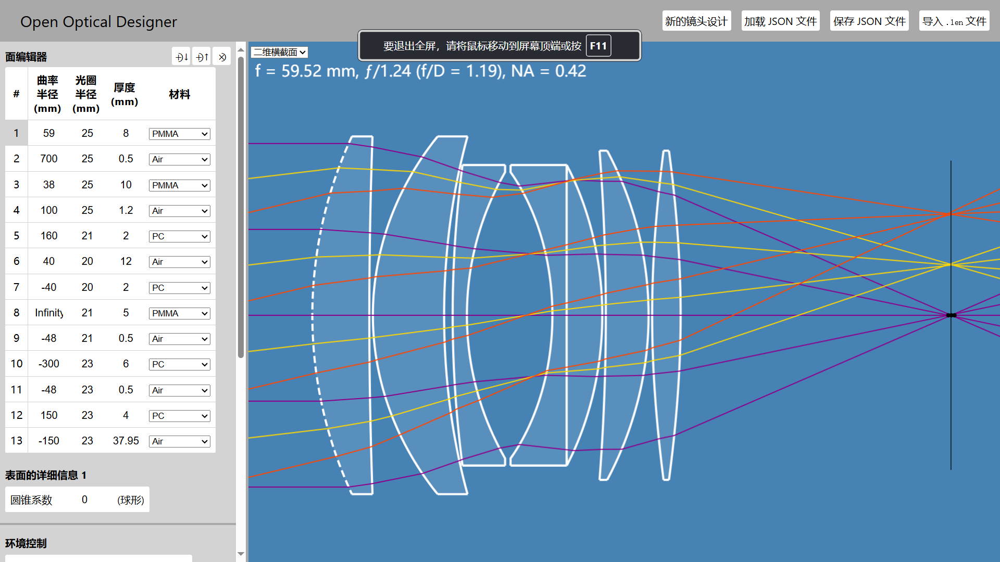

# Open Optical Designer 中文

Alexander Bock

[启动 Open Optical Designer](https://alexbock.github.io/open-optical-designer/)

## 简介

这是一个正在开发中的 web 应用程序，用于设计由连续透镜元件组成的光学透镜。
其目的是支持实际设计，例如用于全画幅相机的大光圈双高斯镜头，可有效控制图像像差。
有效控制图像像差。 并计划在未来支持反射镜和反射望远镜的设计。

## 功能

* 以 3D 形式模拟的全几何光线追踪
* 非球面（圆锥系数）
* 动态计算曲面属性的公式支持
* 射入射线环境控制
* 自动二维横截面视口
* 几何点扩散函数（光斑图）
* 显示焦距、有效f值和数值光圈
* 自动对焦
* 光路长度和相位
* 轴向和横向色差
* 横向射线像差
* 材料数据库
* 将设计保存/加载为本地 JSON 文件
* 从“.len”文件导入设计
* 浅色和深色用户界面配色方案

## 下一步开发的重点功能

* 反射镜（包括双筒望远镜等系统）
* 设计优化

## 未来计划

* 通过 URL 生成用于共享设计的链接
* 示例设计（消色差双合透镜、双高斯透镜、库克三合透镜、历史透镜等）
* 设计生成器/向导（单透镜、消色差双合透镜、望远镜物镜、球面最佳形状透镜等）
* 非偏振光的整体表面透射率
* 场曲率
* 失真
* 阿贝正弦条件
* 波前分析
* 调制传递函数图
* 通过镜头场景模拟（测试图表、天文图、带有可选深度图的自定义照片）
* 3D 设计视图
* 材质浏览器/编辑器

## 未来可能考虑的功能

* 导出用于制造的标准元素图纸 PDF
* 添加到非球面曲面的偶数次多项式项
* 防反射涂层
* 公差

## 使用说明

### 非球面表面

Open Optical Designer 支持从形状曲线旋转出居中、对称的非球面：

$$ z(y) = \frac{y^2}{R + \sqrt{R^2-(K+1)y^2}} $$

由曲率半径定义 $R$ 和圆锥常数 $K$. 射线与的精确解的直接评估来实现。曲面与参数化直线的交点的精确解。附加的偶数多项式项：
$$ {A_4}y^4 + {A_6}y^6  + {A_8}y^8 + {A_{10}}y^{10} + \cdots{} $$

目前还不支持用于更复杂非球面表面的 "射线交点"，因为在没有相交线参数代数解的情况下，需要更复杂的程序来确定射线交点。 derivations`目录
目录中包含寻找这些解决方案过程中的 Python 代码，以供参考。

### 单位

设计参数使用通用测量单位，但设计通常遵循一种标准，例如考虑将单位定为毫米。

需要特定单位（如以微米为单位的设计中心波长）的输入和输出会被适当标注。

### 公式语法和计算

以等号 （'='） 开头的曲面输入场值将被解释为一个公式，该公式可以包括数字、算术运算和对其他曲面场最终值的引用。

支持的运算符：（对于任意操作数 'x' 和 'y'）

* `x + y`: 加
* `x - y`: 减
* `x * y`: 乘
* `x / y`: 除
* `x ^ y`: 幂
* `(x)`: 括号
* `-x`: 取反

支持的曲面变量：（其中 `#` 是以 1 为单位的曲面索引）

* `RC#`: 曲率半径
* `AR#`: 光圈半径
* `TH#`: 厚度
* `CC#`: 圆锥常数

例子:

* 要将表面 2 的光圈半径设置为自动更新以匹配表面 1 的光圈半径，请在表面 2 的光圈半径字段中输入“=AR1”。
* 要将曲面 1 的厚度设置为自动更新为曲面 1 曲率半径的四分之一，请在曲面 1 的厚度字段中输入“=RC1/4”。

请注意，当 "环境控制 "部分中的 "最后一个表面自动对焦 "设置打开时，公式中将无法使用动态厚度。

### 保存和加载 JSON 文件

“保存 JSON 文件”按钮会将当前镜头设计下载为 JSON 文件。  
根据您的浏览器设置，这可能会提示保存文件的位置和名称，或者立即以默认名称（lens-design.json）将文件保存在下载目录中。  
“加载 JSON 文件”按钮可用于加载之前保存到本地文件的镜头设计。JSON 项目文件包含镜头设计和环境设置。

### 导入 ".len" 文件

.len "文件导入功能可导入设计曲面并识别以下参数
曲面参数：

* 曲率半径
* 光圈半径
* 厚度
* 材料
* 圆锥常数

## 开发

### 使用标准网络技术实现，无外部依赖性

本软件不使用任何外部或第三方依赖项、字体、图像、包或框架。
它以纯粹的现代 JavaScript 编写，是一个使用标准 HTML 和 CSS 的单页面应用程序，没有构建、预处理、生成或转换步骤。如果需要，它可以直接在本地浏览器中运行，无需网络服务器。

### 单元测试

打开 `tests/test.html` 在浏览器中运行单元测试套件。

## 版权

见 COPYRIGHT.txt.

## 开源许可证

见 LICENSE.txt.
